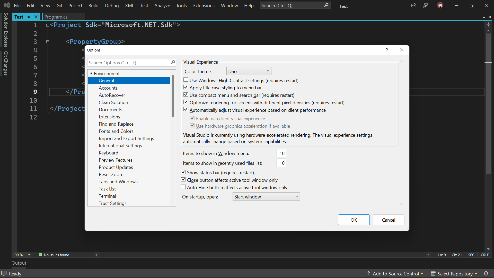
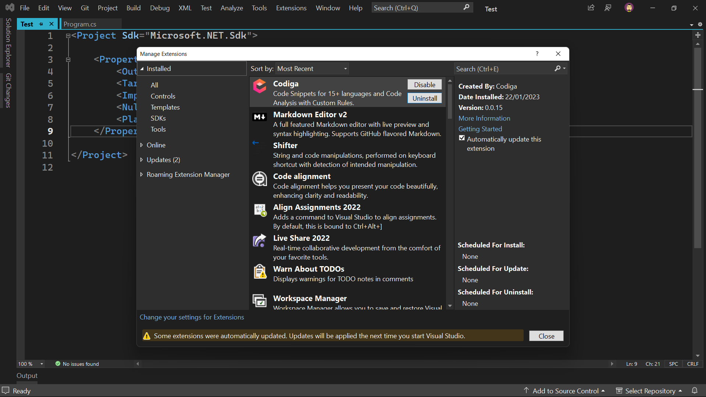

<h3 align="center">Visual Studio configuration</h3>

---

⚙️ This is my Visual Studio configuration.

---

### 🖼️ Screenshots

### 📃 Font
- [Cascadia Mono](https://github.com/microsoft/cascadia-code)

### ⚙️ Extensions
- [Add Existing Projects](https://marketplace.visualstudio.com/items?itemName=RichardJMoss.AddExistingProjects)
- [Add Multiple Projects To Solution](https://marketplace.visualstudio.com/items?itemName=MaciejGudanowicz.AddMultipleProjectsToSolution)
- [Align Assignments](https://marketplace.visualstudio.com/items?itemName=VisualStudioPlatformTeam.AlignAssignments)
- [Auto Surround](https://marketplace.visualstudio.com/items?itemName=reduckted.AutoSurround)
- [Clean Solution](https://marketplace.visualstudio.com/items?itemName=MadsKristensen.CleanSolution)
- [Close Tabs](https://marketplace.visualstudio.com/items?itemName=BenHamida.CloseTabs)
- [Code Alignment](https://marketplace.visualstudio.com/items?itemName=cpmcgrath.Codealignment)
- [Codiga](https://marketplace.visualstudio.com/items?itemName=codiga.vsextension)
- [Comment Remover](https://marketplace.visualstudio.com/items?itemName=MadsKristensen.CommentRemover)
- [Double-Click Maximize 2022](https://marketplace.visualstudio.com/items?itemName=VisualStudioPlatformTeam.Double-ClickMaximize2022)
- [Dummy Text Generator](https://marketplace.visualstudio.com/items?itemName=MadsKristensen.DummyTextGenerator)
- [File Icons](https://marketplace.visualstudio.com/items?itemName=MadsKristensen.FileIcons)
- [Git Pull](https://marketplace.visualstudio.com/items?itemName=MadsKristensen.GitPull)
- [Godot Support](https://github.com/godotengine/godot-csharp-visualstudio)
- [Hot Commands](https://marketplace.visualstudio.com/items?itemName=JustinClareburtMSFT.HotCommands2017)
- [Image Optimizer (64-bit)](https://marketplace.visualstudio.com/items?itemName=MadsKristensen.ImageOptimizer)
- [Image Sprites](https://marketplace.visualstudio.com/items?itemName=MadsKristensen.ImageSprites)
- [Match Margin 2022](https://marketplace.visualstudio.com/items?itemName=VisualStudioPlatformTeam.MatchMargin)
- [Middle Click Scroll 2022](https://marketplace.visualstudio.com/items?itemName=VisualStudioPlatformTeam.MiddleClickScroll)
- [Open Folder Extension 2022](https://marketplace.visualstudio.com/items?itemName=DavidRoller.OpenFolderExtension2019)
- [Output enhancer](https://marketplace.visualstudio.com/items?itemName=NikolayBalakin.Outputenhancer)
- [Productivity Power Tools 2022](https://marketplace.visualstudio.com/items?itemName=VisualStudioPlatformTeam.ProductivityPowerPack2022)
- [Reset Zoom](https://marketplace.visualstudio.com/items?itemName=MadsKristensen.ResetZoom)
- [Select Next Occurrence](https://marketplace.visualstudio.com/items?itemName=thomaswelen.SelectNextOccurrence)
- [Shifter](https://marketplace.visualstudio.com/items?itemName=MadsKristensen.Shifter)
- [SideScroller](https://marketplace.visualstudio.com/items?itemName=drewnoakes.SideScroller)
- [Solution Error Visualizer 2022](https://marketplace.visualstudio.com/items?itemName=VisualStudioPlatformTeam.SolutionErrorVisualizer)
- [Time Stamp Margin 2022](https://marketplace.visualstudio.com/items?itemName=VisualStudioPlatformTeam.TimeStampMargin)
- [Toggle Editor Tooltips](https://marketplace.visualstudio.com/items?itemName=MadsKristensen.ToggleEditorTooltips)
- [Undo Close Tab](https://marketplace.visualstudio.com/items?itemName=reduckted.UndoCloseTab)
- [Warn About TODOs](https://marketplace.visualstudio.com/items?itemName=MattLaceyLtd.WarnAboutTODOs)
- [Workspace Manager](https://marketplace.visualstudio.com/items?itemName=AndreyVeselov.WorkspaceManager)

### 🔧 Settings and Keybindings
You can find find the settings files <a href="./Settings.vssettings">here</a>.
